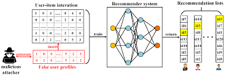
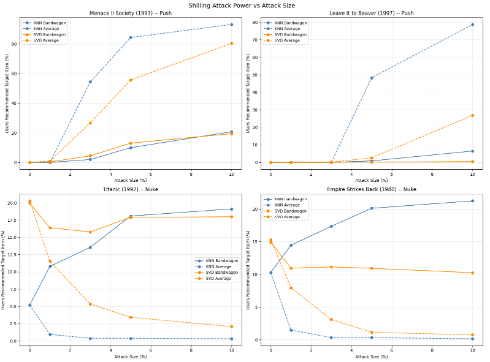

# Adversarial Shilling Attacks on Recommender Systems

An empirical study of shilling attacks — a class of adversarial manipulation where an attacker injects fake user profiles into a rating dataset to bias recommendation outputs in their favor. This project implements push and nuke attacks using two distinct strategies, targets them at specific items chosen to stress-test each strategy, and measures their effectiveness against KNN and SVD recommenders across varying attack sizes.



## What I built

### Attack framework
Designed a system for generating and injecting fake user profiles into a MovieLens dataset. Each fake profile follows a specific attack strategy and is parameterized by:
- **Target item:** the item to push (inflate) or nuke (suppress)
- **Filler items:** a set of other items rated by the fake profile to appear legitimate
- **Attack size:** number of fake profiles injected

### Attack types

**Push attack:** Fake profiles give the target item a maximum rating. The goal is to make the target item appear in recommendation lists for users who would not otherwise have seen it.

**Nuke attack:** Fake profiles give the target item a minimum rating. The goal is to suppress the target item — pushing it out of recommendation lists for users who would have seen it.

### Attack strategies

**Average attack:** Fake profiles rate filler items at the global dataset average, making them statistically indistinguishable from ordinary users at a population level.

**Bandwagon attack:** Fake profiles inflate ratings on a set of globally popular items in addition to the target. The idea is to blend in with high-activity users (power users) to gain more influence in nearest-neighbor models.

### Target item selection
Selected target items strategically to stress-test attack difficulty:
- A naturally low-rated item (hard push target — the system's prior strongly disagrees)
- A mid-rated item (easier push target — smaller correction needed)

### Victim models and measurement
Evaluated both KNN-based and SVD-based recommenders as victims. For each combination of attack type, strategy, and victim model, swept attack size from 0 to a large number of injected profiles and measured how far the target item moved in recommendation rankings. This produces learning curves that reveal how quickly each attack reaches saturation.

## Results



## Key findings

**Push attacks**
- Average attack consistently outperforms Bandwagon for push on both KNN and SVD
- KNN is substantially more vulnerable than SVD — its local neighborhood structure means that a small cluster of fake profiles can dominate a user's neighborhood entirely
- Low-rated items are significantly harder to push than mid-rated items, confirming that the attacker faces diminishing returns against items with a strong existing negative signal

**Nuke attacks**
- Average attack is highly effective at suppression — even a small number of fake profiles dramatically drops the target item's ranking on KNN
- KNN Average nuke achieves near-total suppression at modest attack sizes, making it the most dangerous combination tested
- SVD shows more resilience due to global factorization smoothing out local profile injections, but is not immune

**Mitigation implications**
- Even small attack sizes (5–10 fake profiles per thousand real users) cause measurable ranking shifts
- KNN's local neighborhood structure makes it a structurally softer target than global matrix factorization
- Practical defenses: monitoring for sudden changes in item rating velocity, detecting statistical anomalies in user profile distributions (e.g., suspiciously uniform filler item ratings), and preferring global models in adversarial environments

## Skills demonstrated

- Implementing adversarial attack strategies against recommender systems
- Designing controlled experiments to measure model vulnerability across attack size, strategy, and victim model
- Reasoning about the structural properties of algorithms (KNN locality vs. SVD global factorization) that determine adversarial robustness
- Translating empirical findings into actionable mitigation recommendations

## Notebook

[`shilling_attacks.ipynb`](shilling_attacks.ipynb)

## Dependencies

```
scikit-surprise, pandas, numpy, matplotlib
```
