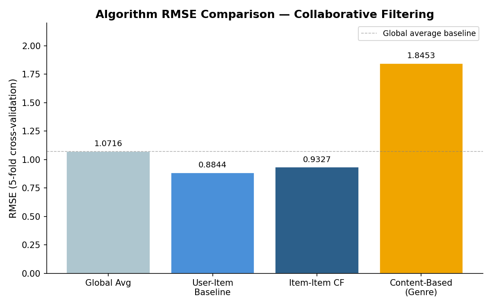

# Collaborative Filtering with Scikit-Surprise

Implements and evaluates a progression of collaborative filtering algorithms inside the [scikit-surprise](https://surpriselib.com/) framework — building from a global baseline up through personalized item-item nearest-neighbor CF and content-based filtering, then running a proper cross-validated evaluation to compare them.

## What I built

### Algorithm 1 — User-Item Average baseline
The prediction is a decomposition of the global mean plus per-user and per-item bias terms:

$$\hat{r}_{ui} = \mu + b_u + b_i$$

While this barely qualifies as personalized (every user gets the same ranked list), it's a critical component: subtracting this baseline from raw ratings before applying other algorithms acts as normalization, reducing the dominance of systematic user/item tendencies and making latent factor models easier to train. I implemented this as a custom Surprise algorithm and verified that downstream SVD RMSE improves when the baseline is subtracted.

### Algorithm 2 — Item-Item Collaborative Filtering
Built a full item-item CF algorithm with a pre-computed, truncated similarity model. The constructor accepts `model_size` (how many items to retain in the similarity index per item) and `neighborhood_size` (how many neighbors to use at prediction time), allowing control over the accuracy/compute trade-off. Uses adjusted cosine similarity to cancel out per-user rating scale differences:

$$\text{sim}(i, j) = \frac{\sum_u (r_{ui} - \bar{r}_u)(r_{uj} - \bar{r}_u)}{\sqrt{\sum_u (r_{ui} - \bar{r}_u)^2} \cdot \sqrt{\sum_u (r_{uj} - \bar{r}_u)^2}}$$

Prediction aggregates neighbor ratings weighted by similarity.

### Algorithm 3 — Content-Based Filtering
Implemented a genre-vector personalized recommender without using any rating data. For each user, builds a preference profile from genres of their rated items, then ranks candidate items by cosine similarity to that profile. Useful as a cold-start fallback and as a comparison baseline to see how much lift rating-based CF provides over pure metadata.

### Evaluation
Ran 5-fold cross-validation across all algorithms with RMSE as the metric. The evaluation confirmed that item-item CF outperforms the global baseline, and that content-only filtering underperforms rating-based methods — but remains useful in sparsity regimes.

## Results



## Key findings

- Using the user-item average as a pre-normalization step consistently lowers SVD RMSE
- Pre-computing a truncated similarity model (rather than computing all pairwise similarities at prediction time) makes item-item CF practical at MovieLens scale
- Content-based filtering has lower RMSE accuracy than CF but produces more interpretable and serendipitous recommendations in qualitative inspection

## Skills demonstrated

- Implementing collaborative filtering algorithms inside a production-grade framework (scikit-surprise)
- Designing pre-computation strategies for similarity models to balance accuracy and latency
- Running and interpreting cross-validated recommendation evaluations
- Understanding the role of normalization and bias correction in model pipelines

## Notebook

[`collaborative_filtering_surprise.ipynb`](collaborative_filtering_surprise.ipynb)

## Dependencies

```
scikit-surprise, pandas, numpy
```

> **Note:** scikit-surprise has limited Python 3.11+ compatibility. See the notebook setup cell for installation details.
