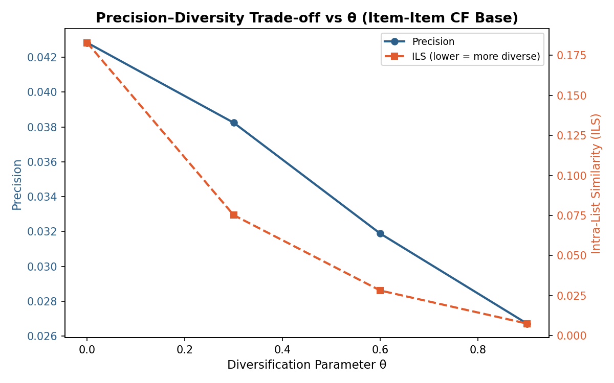

# Diversity-Aware Recommendations & Gradient Descent SVD

An end-to-end replication of core findings from [Ziegler et al., "Improving Recommendation Lists Through Topic Diversification" (WWW 2005)](https://dl.acm.org/doi/10.1145/1060745.1060754), combined with a from-scratch implementation of Funk SVD via stochastic gradient descent. This project demonstrates that optimizing for accuracy alone produces recommendation lists that are technically good but practically boring — and that diversity can be injected as a post-hoc re-ranking step with a controlled accuracy trade-off.

## What I built

### Custom evaluation metrics

**ILS (Intra-List Similarity):** Measures how redundant a recommendation list is by computing average pairwise similarity between all items in the list. I implemented this using the MovieLens tag genome — a high-dimensional vector space where each movie is embedded by how strongly it exhibits ~1000 perceptual tags (atmospheric, thought-provoking, etc.). Lower ILS means a more diverse list.

**Precision:** Fraction of recommended items that appear in the user's held-out set of "good" items. Implemented as a standard Top-N evaluation metric to measure accuracy alongside ILS.

### Ziegler's diversification algorithm
Implemented the greedy re-ranking procedure from the paper. Given a base ranked list, the algorithm iteratively selects items that maximize a linear combination of relevance and dissimilarity to already-selected items:

$$\text{score}(i, L) = (1 - \theta_f) \cdot \text{relevance}(i) - \theta_f \cdot \text{ILS}(L \cup \{i\})$$

The parameter $\theta_f \in [0, 1]$ controls the diversity-accuracy trade-off: at 0, the original ranking is preserved; at 1, the algorithm selects purely for diversity.

### Replication of Ziegler's experiment
Reproduced the paper's key experiment: swept `theta_f` from 0 to 0.9 using User-User and Item-Item as base algorithms, measured precision and ILS at each value, and plotted the trade-off curves. The results replicate the paper's finding that significant diversity gains can be achieved with only modest precision loss in the low-`theta_f` range.

### Funk SVD from scratch
Implemented Simon Funk's matrix factorization algorithm using stochastic gradient descent — no library wrappers. Key components:

- Random initialization of user ($P$) and item ($Q$) latent factor matrices
- Per-rating gradient updates: $P_u \leftarrow P_u + \alpha(e_{ui} Q_i - \lambda P_u)$ and symmetrically for $Q_i$
- L2 regularization to prevent overfitting
- Early stopping based on validation loss

Then used this SVD as a third base algorithm in the Ziegler experiment to compare how a stronger base ranker affects the precision/diversity trade-off curves.

## Results



## Key findings

- Diversity gains from re-ranking are real and replicable: sweeping `theta_f` from 0 to 0.3 reduces ILS substantially with minimal precision loss — confirming the paper's core claim
- Item-Item CF and User-User CF produce similar trade-off curves, suggesting the diversification effect is robust to base algorithm choice
- Funk SVD produces a stronger base ranking, meaning the absolute precision at `theta_f=0` is higher, but the relative gains from diversification are smaller — a stronger ranker leaves less room for diversity to help

## Skills demonstrated

- Replicating a published research paper end-to-end, including experiment design and result interpretation
- Implementing stochastic gradient descent optimization from scratch for matrix factorization
- Building custom evaluation metrics (ILS, precision) for recommendation quality assessment
- Working with auxiliary datasets (tag genome) for item similarity computation
- Analyzing the accuracy/diversity trade-off and understanding its practical implications

## Notebook

[`diversity_and_gradient_descent.ipynb`](diversity_and_gradient_descent.ipynb)

## Dependencies

```
scikit-surprise, pandas, numpy, matplotlib
```
