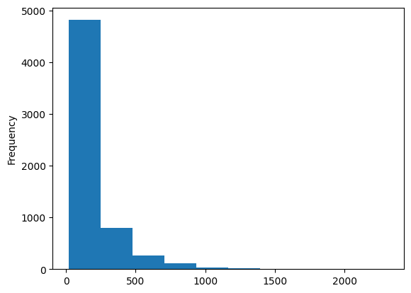
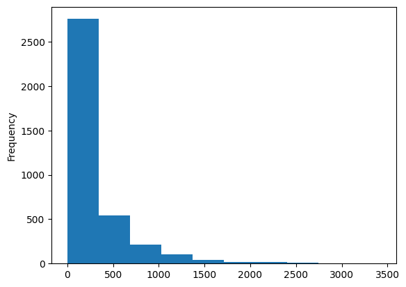

# Non-Personalized & Content-Based Recommendation Techniques

An exploration of foundational recommendation approaches on the MovieLens dataset. This project builds intuition for how data shape, sparsity, and item popularity affect recommendation quality — all before any personalization is applied. It covers the full pipeline from raw data exploration through non-personalized scoring, demographic segmentation, item association rules, and content-based filtering.

## Data distributions





## What I built

### Data exploration
Started by profiling the dataset — computing user, item, and rating counts and visualizing their distributions. Understanding that most users rate very few items and most items receive very few ratings is fundamental to every design decision that follows.

### Damped average rating
Implemented the damped average formula, which pulls item ratings toward the global mean based on a configurable damping factor $\lambda$:

$$\bar{r}_i^{\lambda} = \frac{\sum r_{ui} + \lambda \cdot \mu}{n_i + \lambda}$$

I tested damping factors of 1, 10, 100, and 1000 to analyze how much evidence is needed before an item's rating can be trusted. This is a core technique for dealing with cold-start items in production systems.

### Demographic segmentation
Computed separate damped averages and popularity metrics by self-reported gender and age group, then compared the resulting rankings to evaluate whether demographic signals produce meaningfully different recommendations on MovieLens data. The analysis surfaces important questions about when demographic personalization adds value versus introduces bias.

### Item association rules
Implemented co-occurrence and lift-based association to answer queries like "what else should I recommend to someone who watched Toy Story?" Co-occurrence finds what's most frequently watched together; lift corrects for popularity bias by normalizing against item marginal probabilities.

### Content-based filtering
Built a genre-vector similarity function to find items similar to a seed item using only metadata — no rating data required. This is particularly useful for cold-start scenarios where a new item has no ratings yet.

## Key findings

- A damping factor around 100–1000 stabilizes rating reliability on MovieLens; below that, items with 1–2 five-star ratings unfairly dominate
- The ≥4-star percentage metric produces misleading rankings for low-count items — a direct motivator for damping
- Demographic splits reveal genre preferences that differ by gender and age, but the effect is modest enough that demographic-only personalization would have limited lift over a good global baseline
- Lift-based association is significantly more meaningful than raw co-occurrence for avoiding trivially popular recommendations

## Skills demonstrated

- Analyzing real-world sparse rating datasets
- Implementing scoring algorithms from mathematical definitions
- Reasoning about cold-start, popularity bias, and data sparsity trade-offs
- Designing and interpreting comparative experiments across algorithm variants

## Notebook

[`basic_recommendation_techniques.ipynb`](basic_recommendation_techniques.ipynb)

## Dependencies

```
pandas, numpy, matplotlib, scikit-learn
```
